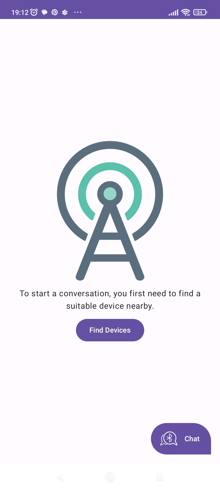
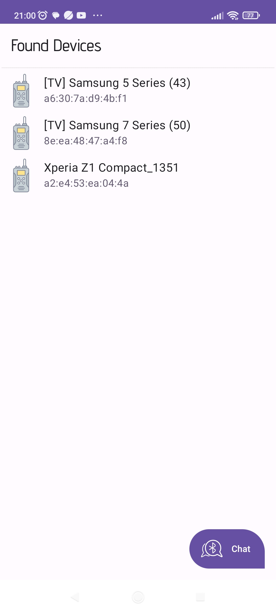
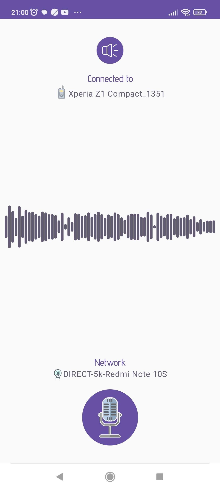
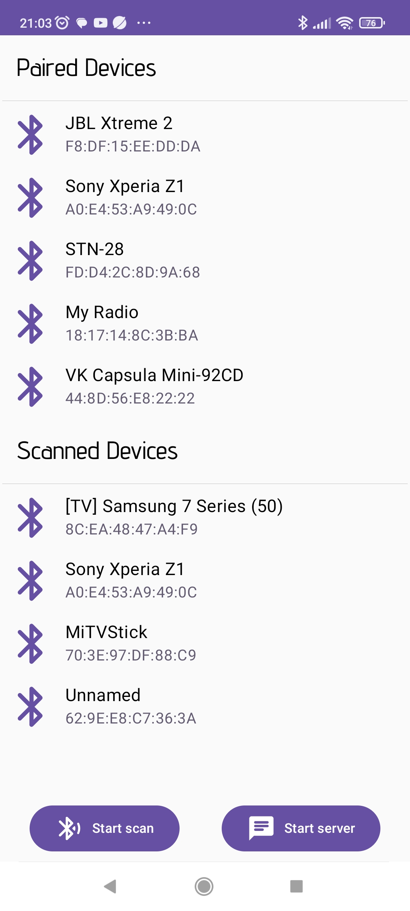
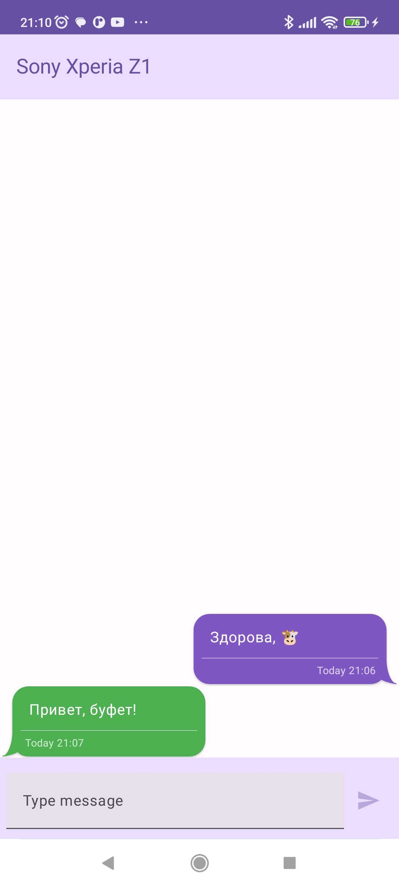

## Описание

Приложение, симулирующее рацию. Дает возможность говорить с собеседником без Интернета, через Wi-Fi
Direct соединение. Так же имеется возможность передавать текстовые сообщения через Bluetooth
соединение.

Для начала разговора нужно начать поиск близлежащих устройств на **обоих** телефонах. Затем
подключится
к телефону собеседника, выбрав его из списка найденных устройств.

Для передачи сообщения нужно удерживать кнопку микрофона.

## Скриншоты

  
  
  
  
  

